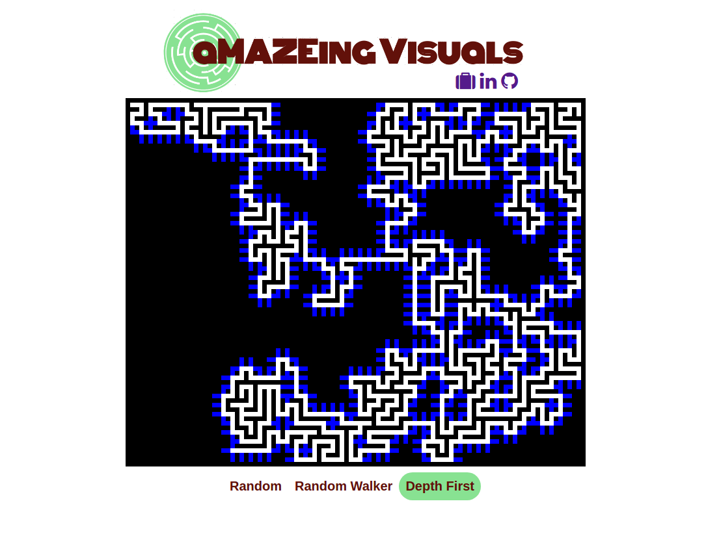

# aMAZEing Visuals


[live](http://www.nathanvass.site/Maze_Visualization/)

Displays visualizations of how different algorithms create mazes. Spaces the computer is "thinking" about expanding into are displayed in blue. Currently features a randomized approach, one using a heap, a depth first approach, and one using a random walker.

## Technologies
- JavaScript
- d3
- JQuery

## Features and Implementation

d3 is used to construct the maze grid. d3 is not used to update the maze because repainting the entire maze and binding the mazes data state using it would take too long to render for a smooth visualization. Instead, I store pointers to all the grid spaces and change their color individually through vanilla JavaScript. JQuery is used for convenient click handling and class manipulation.

## Algorithms ##

### Random ###
The maze begins in the top left with a single square. Now, the following step is repeated:
First, the algorithm computes all valid extensions for whatever space was last opened. Those places are stored in a container that will
hold all the possible expansions for the maze, which are shown in blue. One is chosen at random, the maze fills
in the space, and the process repeats.
### Depth First ###
This approach will extend the maze at random as far as it can go with a single path, then choose
the closest free square to where it ended and repeat the process from there. Basically, this
algorithm tries to keep the maze creation action as far from the start of the maze as possible.
To begin, this algorithm only looks at the first square, and tries to paint each of its adjacent valid spaces.
Before it can move on from painting the first one it chooses (at random), every possible extension from that space must run its course by running that the same process from that space.
### Random Walker ###
This approach can take a while to get started! The maze begins in the top corner, and a random walker
begins stumbling around the board, starting one space removed from the maze. Its path is showed in blue.
If the random walker intersects with the maze at any point, the path is saved, and another walker is created.
If the walker intersects its own path, its path is chopped off at that point. This algorithm moves very quickly once it gets started
because there are more opportunities for the walker to intersect with the maze.
### Heap ###
Here, the maze is generated using the heap data structure, also known as a priority queue.
Potential spaces that the maze can expand into are assigned a random value, and the expansion space associated with the lowest value
is used to continue the maze. Using a heap is not necessary to achieve this functionality, but makes it as efficient and fast as possible.
The algorithm has a directional feel to the way it grows, similar to the depth first approach.
This happens despite using randomness to select moves, because paths with low priorities will wait for a very long time before they are filled.
### Using a timer with depth first algorithm ###

Using asynchronous functions to slow down the rendering of dfs and heap mazes was challenging, because without knowing how long the recursive call would take, it was impossible to know how long to set a timer. I needed some kind a consistent queue, so I separated the maze creation and painting process. First, for every iteration of the maze I stored the spaces to be colored,

```JavaScript
const explore = (start, prev) => {
  let move = {
    white: [],
    black: [],
    blue: []
  };

  if (!$("#dfs").hasClass("selected")){
    return null;
  }
  openExplore(start, prev);
  if (prev){
    move.white.push(intermediateSpace(start, prev));
    move.white.push(prev);
  }
  move.white.push(start);

  surroundingPositions(start).forEach((square) => {
    if (isValidSpace(square)){
      move.blue.push(intermediateSpace(start, square))
      move.blue.push(square)
    }
    else if (square[0] !== start[0] || square[1] !== start[1]){
      move.black.push(intermediateSpace(start, square))
     }
  });
  moves.push(move);
  let exploreFrontier = surroundingPositions(start).shuffle();
  exploreFrontier.forEach((probe) => {
    explore(probe, start)
  });
};
```

Then, I iterated over those maze states, adding a timer.

```JavaScript
const drawDFS = (moves) => {
    moves.forEach((move, i) => {
      timeout = setTimeout(() => {
        move.blue.forEach((pos) => paintBlue(pos))
        move.black.forEach((pos) => paintBlack(pos))
        move.white.forEach((posi) => paintWhite(posi))
      }, 10 * i)
      timeouts.push(timeout);
    })
}
```

### d3 Repainting
It was not feasible to re-render my grid at every stop of the maze from the underlying grid data, that would result in each rectangle being rerendered separately at each maze iteration and would result in a very slow and buggy visualization. Instead, I stored pointers to each grid of the svg I created using d3, and manipulated the color of only the squares I needed to change.

```JavaScript
  function buildGrid(){
    let svg = d3.select("#maze")
    .append("svg")
    .style("border", "solid black")
    .style("border-width", "7px 0px 0px 7px")
    .attr("width", 700)
    .attr("height", 560);
    for (let i = 0; i < 100; i++){
      for(let j = 0; j < 80; j++ ){
        svg.append("rect")
        .attr({
          x: i * 7,
          y: j * 7,
          width: 7,
          height: 7,
          fill: "black"
          })
        pointers[i][j] = d3.selectAll("rect").last()[0][0];
      }
    }
  };
```

## Future Features
1. Add more algorithms
2. Add a maze solver
3. Refactor code 
