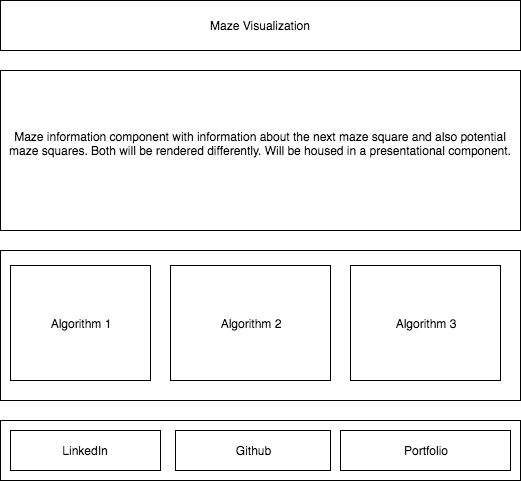

## Maze Creation Visualizations

### Background

Although finished mazes may look similar, the algorithms used to create them can be extremely varied. This project will show the process of maze creation using different algorithms.

### Functionality & MVP  

Users should be able to do the following:

- [ ] View completed mazes
- [ ] View the process of building that maze
- [ ] Select from multiple algorithm approaches to building the mazes
- [ ] The process is animated with attractive visualizations

In addition, this project will include:

- [ ] A production README

### Wireframes

This app will consist of multiple maze boards, labeled by algorithm type. When a user clicks on a board, the maze will be created. Each board corresponds to a different canvas.

### Architecture and Technologies

This project will be implemented with the following technologies:

- JavaScript for maze creation logic
- d3 data visualization library for dom manipulation,
- html5 with canvas to display the mazes
- react to allow users to toggle which maze is displayed

### Implementation Timeline

**Day 1**: Get three canvases on the page, create a grid of maze squares and be able to access and manipulate them. Create a click handler. Load a sample maze on the page from the same data format the algorithms will produce.

**Day 2**: Toggle which maze is displayed using react. Write maze creation algorithms using randomness, random walker, and dfs approaches to maze creation. Allow these mazes to be generated on click. Slow down the process and add attractive visual elements.

**Day 3**: Either finish day two's work or add a more efficient algorithm.

### Bonus features

- [ ] Invent a maze creation or solving algorithm
- [ ] Allow users to navigate the maze
- [ ] Allow users to customize visualizations
