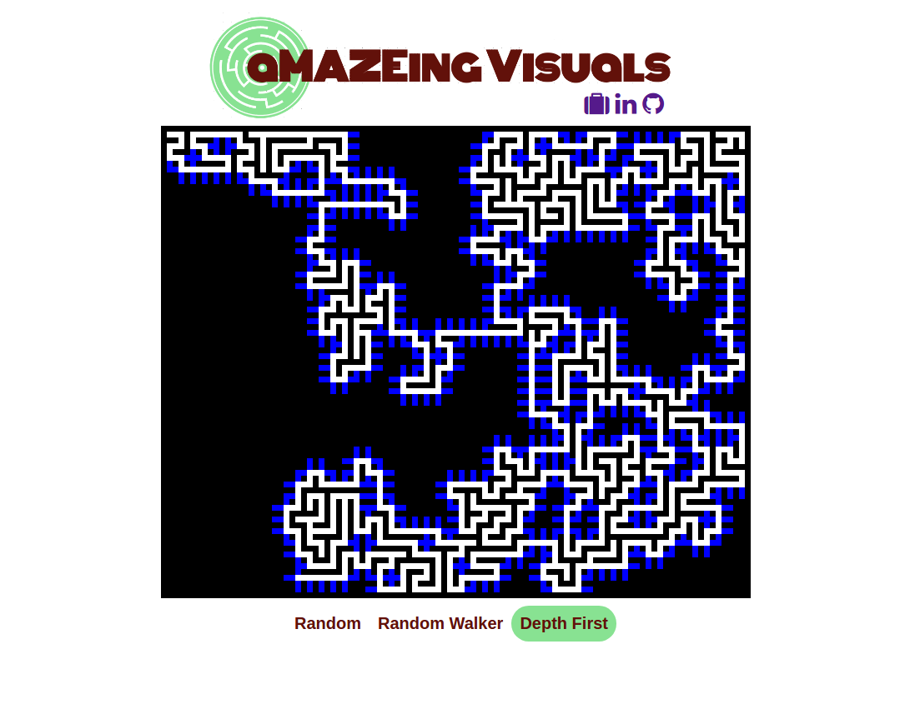

# aMAZEing Visuals


[live](http://th3nathan.github.io/maze/)

Displays visualizations of how different algorithms create mazes. Spaces the computer is "thinking" about expanding into are displayed in blue. Currently features a randomized approach and a depth first approach.

## Technologies
- JavaScript
- d3
- JQuery

## Features and Implementation

d3 is used to construct the maze grid. d3 is not used to update the maze because repainting the entire maze and binding the mazes data state takes too much time. Instead, I store pointers to all the grid spaces and change thier color induvidually through vanilla JavaScript. JQuery is used for convenient click handling and class manipulation.

###Using a timer with depth first algorithm###

Using asynchronous functions to slow down the rendering of dfs maze creations was challenging, because without knowing how long the recursive call would take, it was impossible to know how long to set a timer. To get around this, I seperated the maze creation and painting process. First, for every iteration of the maze I stored the spaces to be colored,

```JavaScript
const explore = (start, prev) => {
  let move = {
    white: [],
    black: [],
    blue: []
  };

  if (!$("#dfs").hasClass("selected")){
    return null;
  }
  openExplore(start, prev);
  if (prev){
    move.white.push(intermediateSpace(start, prev));
    move.white.push(prev);
  }
  move.white.push(start);

  surroundingPositions(start).forEach((square) => {
    if (isValidSpace(square)){
      move.blue.push(intermediateSpace(start, square))
      move.blue.push(square)
    }
    else if (square[0] !== start[0] || square[1] !== start[1]){
      move.black.push(intermediateSpace(start, square))
     }
  });
  moves.push(move);
  let exploreFrontier = surroundingPositions(start).shuffle();
  exploreFrontier.forEach((probe) => {
    explore(probe, start)
  });
};
```

Then, I iterated over those maze states, adding a timer.

```JavaScript
const drawDFS = (moves) => {
    moves.forEach((move, i) => {
      timeout = setTimeout(() => {
        move.blue.forEach((pos) => paintBlue(pos))
        move.black.forEach((pos) => paintBlack(pos))
        move.white.forEach((posi) => paintWhite(posi))
      }, 10 * i)
      timeouts.push(timeout);
    })
}
```

### d3 Repainting
It was not feasable to re-render my grid at every stop of the maze from the underlying grid data, because it would take too long. Instead, I stored pointers to each grid of the svg I created using d3, and manipulated the color of only the squares I needed to change.

```JavaScript
  function buildGrid(){
    let svg = d3.select("#maze")
    .append("svg")
    .style("border", "solid black")
    .style("border-width", "7px 0px 0px 7px")
    .attr("width", 700)
    .attr("height", 560);
    for (let i = 0; i < 100; i++){
      for(let j = 0; j < 80; j++ ){
        svg.append("rect")
        .attr({
          x: i * 7,
          y: j * 7,
          width: 7,
          height: 7,
          fill: "black"
          })
        pointers[i][j] = d3.selectAll("rect").last()[0][0];
      }
    }
  };
```

## Future Features
1. Add more algorithms
2. Add a maze solver
